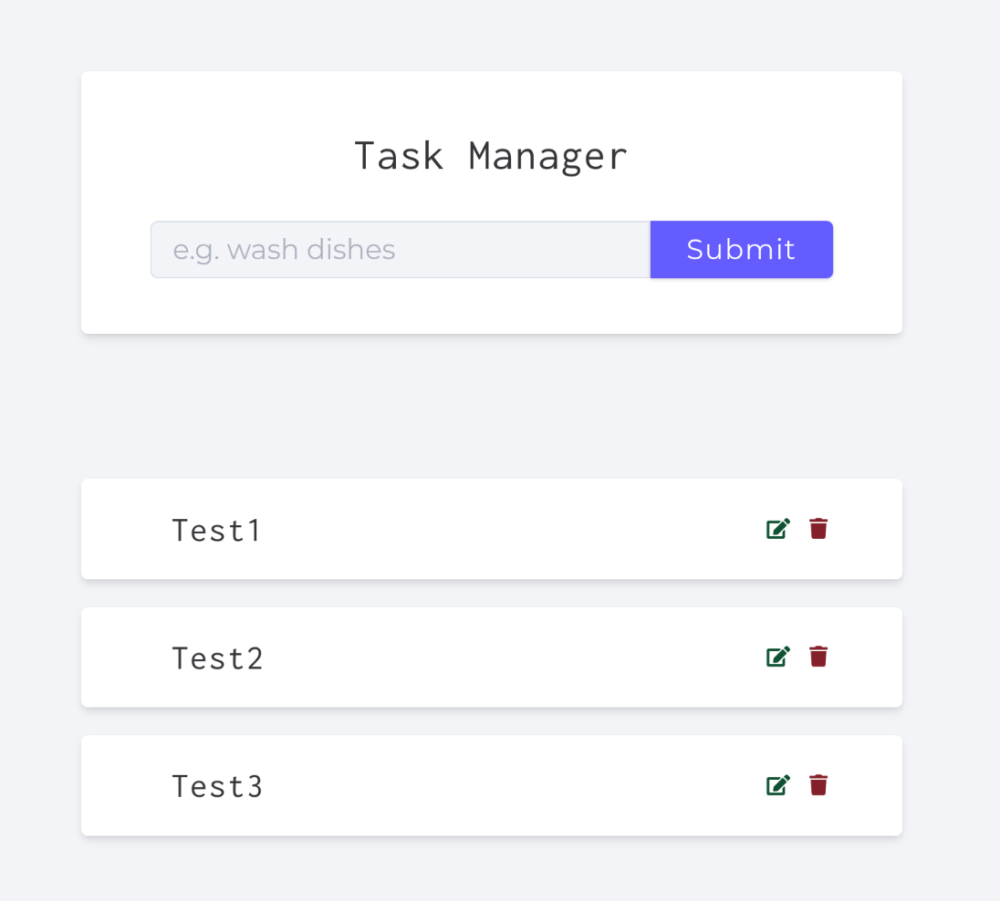

# My Todo Project

Описание проекта: 
- Технологии: Express, Nodemon, JSDOM, MongoDB.
- Проект: Обычная ToDo для записи, имеющая CRUD функционал.

---

---

## 🛠️ Установка и настройка

### 1. Установите зависимости

```bash

npm install
```

### 2. Настройте переменные окружения

Создайте файл `.env` в корне проекта и заполните его согласно примеру:

```bash

cp .env.example .env
```

Откройте файл `.env` и укажите актуальные значения для ваших переменных, на примере .env.example

### 3. Запустите проект

```bash

npm start
```


Через докер запустить базу данных:
```bash
docker run -d \                                         
  --name mongodb \
  -p 27017:27017 \
  -e MONGO_INITDB_ROOT_USERNAME=user \
  -e MONGO_INITDB_ROOT_PASSWORD=password \
  -e MONGO_INITDB_DATABASE=admin \
  mongo
```

Проект без бекенда, к сожалению, не может работать полноценно на Github Pages.